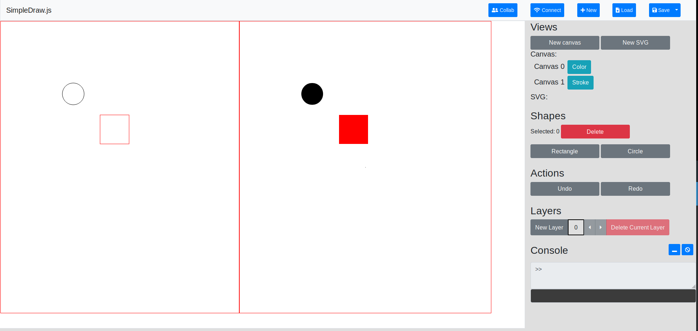

# SimpleDraw

## Introduction
SimpleDraw is a project developed for the subject of Software Systems Architecture of the Integrated Masters in Informatics and Computing Engineering.

SimpleDraw consists of a collaborative painting tool, developed in typescript, with as few external packages as possible, to allow the application of as much knowledge as possible.

The main objective was to develop a graphical editor to draw basic geometric objects, manipulate and persist them, with the possibility to add collaborators to a project and have multiple collaborators drawing on the same project, conflict free.

## Goals

Develop a graphical editor to draw basic geometric objects, manipulate and persist them.

* Develop using HTML-related technologies (SVG, Canvas)
* All client-side (running in the browser)
* Use Typescript instead of pure javascript
* Zero-dependencies for the engine
* Libraries for non-engine stuff only (sass, bootstrap)

## Functionalities

To have an extendible tool, well designed and ready to be improved, the following functionalities were set as system requiremtents:

* [x] SimpleDraw is based on the notion of documents
* [x] Documents are rendered either in SVG or HTMLCanvas
* [x] Support persistence in multiple formats: TXT, XML, BIN
* [x] Extendible with different objects (triangles, arrows, etc)
* [x] Extendible with new tools (rotate, translate shapes)
* [x] Support area selections
* [x] Support layers of objects
* [x] Multiple views of the same model in the screen
* [x] Viewport tools (translate, zoom on the viewport)
* [x] Different view styles per viewport (wireframe, color)
* [x] Two interaction modes: *point-n-click* and *REPLs*
* [x] Support (un)limited Undo/Redo of all operations
* [x] **OP MODE** Collaborate using multiple browsers and no backend/server

## Implementation Details

In this section, we describe our approach on the development of each requirement, as detailed as possible.

#### SVG & Canvas
To make it possible to have 2 methods of rendering each object - SVG and HTMLCanvas - it was used the **Strategy Pattern**. Each of this methods have a *draw* method, that draws each object in its specific way.
The following diagram shows how the renders are structured.


#### Support persistence in multiple formats: TXT, XML, BIN
In order to be able to export/import the model in different formats the **Strategy pattern** was used. First, the FileManager interface was defined with two methods: save and load, meaning export and import respectively. In order to add support to a new file format, it is only required to create a class that implements the interface such as the currently implemented XMLFileManager and TXTFileManager. Finally, to simplify the creation and usage of the correct strategy whenever needed a simple string based factory FileManagerFactory was added. On the diagram below, it is visible the use of the pattern and how the classes are organized.


#### Extendible with different objects
The system must use of different objects, allowing the same actions (create, delete, translate, etc) to be applied to all of them. To do so, we users the **Strategy Pattern** to have multiple objects (shapes) descending from one class Shape. If there is the need to add new objects, e.g. a triangle, we need to create a class Triangle that extends Shape, and complete the methods that it needs. The diagram below displays the structure of the object classes.


#### Extendible with new tools
The shape tools implementation is modular, so to add new tools, e.g. rotation of shapes, we must create a new RotateAction that implements Action, and add on the SimpleDrawDocument a function to create the action and call its do(). The diagram below displays how the actions are structured, just like with the shapes, they follow the **Strategy Pattern**, which eases the addition of new tools (actions).


#### Area Selection
The system allows the user to temporarily select an area that can contain several shapes. With this, the user can make actions to the selected number. To make this possible and very modular, we used the **Composite Pattern**, so that a AreaSelected is a Shape that contains several Shapes, as we can see in the code below:

```typescript
export class AreaSelected extends Shape {
    selectedShapes: Array<Shape>

    constructor(public id: number, public x: number, public y: number, public width: number, public height: number, public shapes: Array<Shape>) {
        super(id, x, y)
        this.centerX = x + width / 2
        this.centerY = y + height / 2
        this.color = 'yellow'
        this.selectedShapes = shapes
    }

    updateCenter() {
        this.centerX = this.x + this.width / 2
        this.centerY = this.y + this.height / 2
    }

    udpateSelectedShapes(shapes: Array<Shape>): void {
        this.selectedShapes = shapes
    }

    checkIfHit(mx: number, my: number, render: CanvasRender | SVGRender): boolean {
        var sx = getCoordWithZoom(this.x, render.originalCenterX, render.centerX, render.zoom)
        var sy = getCoordWithZoom(this.y, render.originalCenterY, render.centerY, render.zoom)
        if (mx >= sx && my >= sy && mx <= sx + this.width * render.zoom && my <= sy + this.height * render.zoom)
            return true
        return false
    }

    checkIfBetween(startX: number, startY: number, width: number, height: number, render: CanvasRender | SVGRender): boolean {
        var sx = getCoordWithZoom(this.x, render.originalCenterX, render.centerX, render.zoom)
        var sy = getCoordWithZoom(this.y, render.originalCenterY, render.centerY, render.zoom)
        var lastX = startX + width
        var lastY = startY + height
        if (startX <= sx && (sx + this.width * render.zoom) <= lastX && startY <= sy && (sy + this.height * render.zoom) <= lastY)
            return true
        return false
    }

    toString(): string {
        return 'Area Selected'
    }
}
```

With this, it is possible to do shape actions, like translate, and the class AreaSelected specifies this action for itself. This allows the selection to be modular and iterate above the Shape class.
The diagram below shows the relation between the AreaSelected and the shapes. It is important to refer that an AreaSelected cannot contain another AreaSelected inside it, because it makes no sense in the context.


#### Support layers of objects
SimpleDraw as the functionality of creating and deleting layers. These layers allow to create objects that are independent from objects in other layers. These makes it easy to only make actions of the selected layer. Besides this, it allows for the deletion of several objects at once, by deleting their layer.

#### Multiple views of the same model in the screen
The system should allow the user to create new views in run time and still have all objects that were created before and all operations that have happened.
To do this, the objects and operations are not stored on the views, but on a class which contains the objects and operations' information. By doing so, the views can then access the information and know where and how to position each object, regardless of the view's zoom, axis position, etc.
This approach consists of a **MVC** application, in which the Shape class is the model, the Render class is the view and the controller, although not being completely defined and separated in a single class, is split through some classes that have the need to work on the shapes.

#### Viewport tools (translate, zoom on the viewport)
To support viewport tools, we use mouse events, such as the scroll event to zoom in or zoom out on the scene, or the click and drag (mousedown + mouseup with different coordinates) to translate the whole scene. This problem takes advantage of the previous one (**Multiple views of the same model in the screen**), in the sense that it only applies the viewport tool to the viewport where the mouse is, not affecting the others. It also takes advantage of the **Strategy** described on the first problem (**SVG & Canvas**), since each viewport (render) is independent from all others, so actions taken on one viewport don't affect the others.
On the image below, we can see the four "tools" implemented for the existing renders, draw, setStyle, applyZoom and translate. To add more tools, for example, rotate the viewport, the developer needs to add a method to the renders (and the Render interface) that implements the desired tool.

```typescript
draw(...objs: Array<Shape>): void {
    this.style.draw(this, ...objs)
}

setStyle(style: Style): void {
    this.style = style
}

applyZoom(val: number): void {
    val = val > 0 ? 6 / 5 : 5 / 6
    this.zoom *= val
}

translateScene(xd: number, yd: number): void {
    this.centerX += xd
    this.centerY += yd
}
```

#### Different view styles per viewport
To make the styling possible we used the **Strategy Pattern**, where each render has a *Style*. We also used the **State Pattern** to change the style when the user clicks in the *Color/Stroke* button. We currently have 2 styles: *Wireframe* and *Color*. However, it is easy to expand and add more: create 2 classes (one for SVG and other for Canvas) that implement the interface *Style*, and the method *draw* is the one responsible for implementing the drawing logic. 
There was also a possibility of doing this with the *Decorator Pattern*, however we didn't want to implement one or more styles at the same time and we wanted to be able to change styles at runtime.
Below we can see the *Style* interface and an implemention of the Color mode for Canvas as well as the functionality in action:
```typescript
export interface Style {
    draw(render: Render, ...objs: Array<Shape>): void
}

export class ColorCanvasRender implements Style {

    draw(render: CanvasRender, ...objs: Array<Shape>): void {
        render.ctx.clearRect(0, 0, render.canvas.width, render.canvas.height)
        render.ctx.fillRect(render.centerX, render.centerY, 1, 1); // fill in the pixel at (10,10)
        for (const shape of objs) {
            if (shape instanceof Circle) {
                render.ctx.beginPath()
                render.ctx.fillStyle = shape.color
                render.ctx.ellipse(
                    getCoordWithZoom(shape.x, render.originalCenterX, render.centerX, render.zoom),
                    getCoordWithZoom(shape.y, render.originalCenterY, render.centerY, render.zoom),
                    shape.radius * render.zoom,
                    shape.radius * render.zoom,
                    0, 0, 2 * Math.PI)
                render.ctx.fill()
            } else if (shape instanceof Rectangle) {
                render.ctx.fillStyle = shape.color
                render.ctx.fillRect(
                    getCoordWithZoom(shape.x, render.originalCenterX, render.centerX, render.zoom),
                    getCoordWithZoom(shape.y, render.originalCenterY, render.centerY, render.zoom),
                    shape.width * render.zoom,
                    shape.height * render.zoom
                )
            }
            else if (shape instanceof AreaSelected) {
                render.ctx.strokeStyle = shape.color
                render.ctx.strokeRect(
                    getCoordWithZoom(shape.x, render.originalCenterX, render.centerX, render.zoom),
                    getCoordWithZoom(shape.y, render.originalCenterY, render.centerY, render.zoom),
                    shape.width * render.zoom,
                    shape.height * render.zoom
                )
            }
        }
    }
}
```


#### Two interaction modes: *point-n-click* and *REPLs*
For the REPL, a simple interpreter was created based on the **Interpreter pattern**. First, the string inserted by the user in the frontend is passed to the interpreter which starts by tokenizing it using a set of valid regex string patterns. Then, the tokens are parsed and converted into a simple abstract syntax tree (AST) matching the interpreter's expected structure (grammar validations are made during this process). Finally, the interpreter is ready to execute the corresponding command by running the interpret method of the root of the tree which collects the required information in a context and calls the corresponding action. The grammar includes creation and deletion expressions for the different shapes and the operations applied to them such as translations and accepts the following commands:

* circle x y radius
* rectangle x y width height
* translate fig_id dx dy
* delete fig_id

The grammar is very simple only containing terminal expressions but could easily be expanded to be more complex with multiple compound expressions. However, this would also require more effort regarding the parsing and building of the AST to match the more complex grammar, which even though can parse multiple expressions only interprets the first one at the moment.

#### Undo/Redo 
It must be possible to undo/redo any action made in the editor. First of all, every change made in the document had to be translated to an action. This corresponds to the **Command Pattern**.
To apply the undo/redo, there are 2 stacks, the *doStack* and the *undoStack*. When an action is made (create shape, translate shape, etc), the action is added to the *doStack* and the *undoStack* is emptied, so that it doesn't create problems if a redo was made before. Each action has a *do* and *redo* method, the first when an action is first made or when the redo is of the *undoManager* is called. The *redo* method of the action is the reverse of said action and is called when the *undo* method of the *undoManager* is called.
The following images display how the actions are stored on the stacks and how they are moved from one to another. After the sequence that caused the context of the second image, if a redo() was called, *Action5* would be removed from the *undoStack* and would go back to the place were it was on the *doStack*.


#### **OP MODE** Collaborate using multiple browsers and no backend/server
The system should allow users to collaborate on a project, using multiple browsers/machines. To do so, we used webRTC to communicate between peers, on a peer2peer basis. When a user makes an action on the project, it is sent to all his peers, in order for them to update the project's state. To ensure consistency in all instances, we applied a consensus method based on the timestamps of actions, so that if multiple users act on the same object at the same time, only 1 action should applied, instead of all of them. When a new peer connects to a peer that is sharing his project, he receives the actual state of the project all at once, to become up-to-date and from there on receives and sends actions. In case of failure, if a peer loses connection to another, it must reconnect and the process is the same, it receives the actual state of the project and from there on, receives and sends actions.


On the image above, we have four peers all connected, where Peer1 is connected to Peer2 and Peer3 (which means that Peer2 and Peer3 connected to Peer1) and Peer4 is connected to Peer3. Therefore, when a message *message1* is sent from Peer1 (e.g. when Peer1 creates a rectangle), the message propagates through all peers and each peer receives it once (so there are no possible duplicates of messages) and each peer decides if the action should be applied, according to the consensus method explained above.
With the implemented structure, we believe that every peer is always up-to-date and synchronized with all others, even if connection is lost, because when it is restored, the peer receives the up-to-date state of the project.

## Conclusions

After concluding the project, we believe that it was a success, since we were able to implement more than we believed on the beginning. With this said, we implemented all the requirements keeping the system modular and simple, to easily allow extensions and improvements to it.

If we had more time, we could have improved the communication system, added more tools, such as rotations or resizes, or even turn the tool into a 3D tool. This last one would require a bit more time than the others, just a bit.

## Contributors

* Ana Margarida Silva
* Bruno Piedade
* Danny Soares

## Honorable Mentions 

The following people contributed to the first stages of the project (developed in class)

* André Cruz
* Davide Costa
* Hugo Sereno
