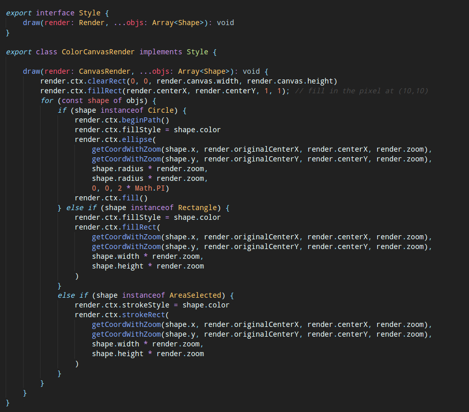

# SimpleDraw

## Goals

Develop a graphical editor to draw basic geometric objects, manipulate and persist them.

* Develop using HTML-related technologies (SVG, Canvas)
* All client-side (running in the browser)
* Use Typescript instead of pure javascript
* Zero-dependencies for the engine
* Libraries for non-engine stuff only (sass, bootstrap)

## Functionalities

* [x] SimpleDraw is based on the notion of documents
* [x] Documents are rendered either in SVG or HTMLCanvas
* [x] Support persistence in multiple formats: TXT, XML, BIN
* [ ] Extendible with different objects (triangles, arrows, etc)
* [x] Extendible with new tools (rotate, translate shapes)
* [x] Support area selections
* [x] Support layers of objects
* [x] Multiple views of the same model in the screen
* [x] Viewport tools (translate, zoom on the viewport)
* [x] Different view styles per viewport (wireframe, color)
* [x] Two interaction modes: *point-n-click* and *REPLs*
* [x] Support (un)limited Undo/Redo of all operations
* [ ] **OP MODE** Collaborate using multiple browsers and no backend/server

## Problems 

#### SVG & Canvas
To make it possible to have 2 methods of rendering each object - SVG and HTMLCanvas - it was used the **Strategy Pattern**. Each of this methods have a *draw* method, that draws each object in its specific way.

#### Support persistence in multiple formats: TXT, XML, BIN
TODO Bruno

#### Extendible with different objects
The system must use of different objects, allowing the same actions (create, delete, translate, etc) to be applied to all of them. To do so, we users the **Strategy Pattern** to have multiple objects (shapes) descending from one class Shape. If there is the need to add new objects, e.g. a triangle, we need to create a class Triangle that extends Shape, and complete the methods that it needs.

#### Extendible with new tools
The shape tools implementation is modular, so to add new tools, e.g. rotation of shapes, we must create a new RotateAction that implements Action, and add on the SimpleDrawDocument a function to create the action and call its do().

#### Area Selection
The system allows the user to temporarily select an area that can contain several shapes. With this, the user can make actions to the selected number. To make this possible and very modular, we used the **Composite Pattern**, so that a AreaSelected is a Shape that contains several Shapes, as we can see in the code below:

With this, it is possible to do shape actions, like translate, and the class AreaSelected specifies this action for itself. This allows the selection to be modular and iterate above the Shape class.

#### Support layers of objects
SimpleDraw as the functionality of creating and deleting layers. These layers allow to create objects that are independent from objects in other layers. These makes it easy to only make actions of the selected layer. Besides this, it allows for the deletion of several objects at once, by deleting their layer.

#### Multiple views of the same model in the screen
The system should allow the user to create new views in run time and still have all objects that were created before and all operations that have happened.
To do this, the objects and operations are not stored on the views, but on a class which contains the objects and operations' information. By doing so, the views can then access the information and know where and how to position each object, regardless of the view's zoom, axis position, etc.
This approach consists of a **MVC** application, in which the Shape class is the model, the Render class is the view and the controller, although not being completely defined and separated in a single class, is split through some classes that have the need to work on the shapes.

#### Viewport tools (translate, zoom on the viewport)
To support viewport tools, we use mouse events, such as the scroll event to zoom in or zoom out on the scene, or the click and drag (mousedown + mouseup with different coordinates) to translate the whole scene. This problem takes advantage of the previous one (**Multiple views of the same model in the screen**), in the sense that it only applies the viewport tool to the viewport where the mouse is, not affecting the others.

#### Different view styles per viewport
To make the styling possible we used the **Strategy Pattern**, where each render has a *Style*. We also used the **State Pattern** to change the style when the user clicks in the *Color/Stroke* button. We currently have 2 styles: *Wireframe* and *Color*. However, it is easy to expand and add more: create 2 classes (one for SVG and other for Canvas) that implement the interface *Style*, and the method *draw* is the one responsible for implementing the drawing logic. 
There was also a possibility of doing this with the *Decorator Pattern*, however we didn't want to implement one or more styles at the same time and we wanted to be able to change styles at runtime.
Below we can see the *Style* interface and an implemention of the Color mode for Canvas as well as the functionality in action:

#### Two interaction modes: *point-n-click* and *REPLs*
TODO Bruno

#### Undo/Redo 
It must be possible to undo/redo any action made in the editor. First of all, every change made in the document had to be translated to an action. This corresponds to the **Command Patter**.
To apply the undo/redo, there are 2 stacks, the *doStack* and the *undoStack*. When an action is made (create shape, translate shape, etc), the action is added to the *doStack* and the *undoStack* is emptied, so that it doesn't create problems if a redo was made before. Each action has a *do* and *redo* method, the first when an action is first made or when the redo is of the *undoManager* is called. The *redo* method of the action is the reverse of said action and is called when the *undo* method of the *undoManager* is called. 

#### **OP MODE** Collaborate using multiple browsers and no backend/server
The system should allow users to collaborate on a project, using multiple browsers/machines. To do so, we used websockets to communicate between the multiple instances of the system. When a user makes an action on the project, it is sent via socket to all other users connected to the socket, in order for them to update the project's state. To ensure consistency in all instances, we applied a consensus method based on the timestamps of actions, so that if multiple users touch the same object at the same time, only 1 action is applied, and not all of them.
