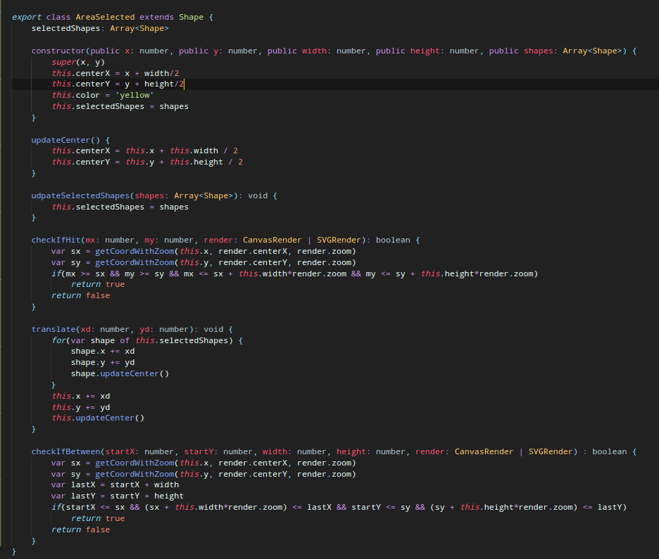

# SimpleDraw

## Goals

Develop a graphical editor to draw basic geometric objects, manipulate and persist them.

* Develop using HTML-related technologies (SVG, Canvas)
* All client-side (running in the browser)
* Use Typescript instead of pure javascript
* Zero-dependencies for the engine
* Libraries for non-engine stuff only (sass, bootstrap)

## Functionalities

* [x] SimpleDraw is based on the notion of documents
* [x] Documents are rendered either in SVG or HTMLCanvas
* [x] Support persistence in multiple formats: TXT, XML, BIN
* [x] Extendible with different objects (triangles, arrows, etc)
* [ ] Extendible with new tools (rotate, translate shapes)
* [x] Support area selections
* [x] Support layers of objects
* [x] Multiple views of the same model in the screen
* [ ] Viewport tools (translate, zoom on the viewport)
* [ ] Different view styles per viewport (wireframe, color)
* [x] Two interaction modes: *point-n-click* and *REPLs*
* [x] Support (un)limited Undo/Redo of all operations

* [ ] **OP MODE** Collaborate usign multiple browsers and no backend/server

## Problems 

#### SVG & Canvas
To make it possible to have 2 methods of rendering each object - SVG and HTMLCanvas - it was used the **Strategy Pattern**. Each of this methods have a *draw* method, that draws each object in its specific way.

#### Undo/Redo 
It must be possible to undo/redo any action made in the editor. First of all, every change made in the document had to be translated to an action. This corresponds to the **Command Patter**.
To apply the undo/redo, there are 2 stacks, the *doStack* and the *undoStack*. When an action is made (create shape, translate shape, etc), the action is added to the *doStack* and the *undoStack* is emptied, so that it doesn't create problems if a redo was made before. Each action has a *do* and *redo* method, the first when an action is first made or when the redo is of the *undoManager* is called. The *redo* method of the action is the reverse of said action and is called when the *undo* method of the *undoManager* is called. 

#### Multiple views of the same model in the screen
The system should allow the user to create new views in run time and still have all objects that were created before and all operations that have happened.
To do this, the objects and operations are not stored on the views, but on a class which contains the objects and operations' information. By doing so, the views can then access the information and know where and how to position each object, regardless of the view's zoom, axis position, etc.
This approach consists of a **MVC** application, in which the Shape class is the model, the Render class is the view and the controller, although not being completely defined and separated in a single class, is split through some classes that have the need to work on the shapes.

#### Area Selection
The system allows the user to temporarily select an area that can contain several shapes. With this, the user can make actions to the selected number. To make this possible and very modular, we used the **Composite Pattern**, so that a AreaSelected is a Shape that contains several Shapes, as we can see in the code below:

With this, it is possible to do shape actions, like translate, and the class AreaSelected specifies this action for itself. This allows the selection to be modular and iterate above the Shape class.
